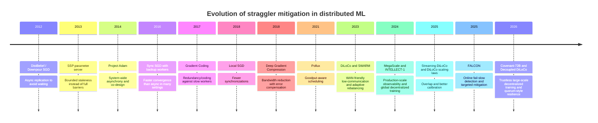

# Straggler Mitigation in Distributed ML Training

## Executive summary

Stragglers are not a niche annoyance. In modern distributed training, a single slow rank, failed GPU, congested link, imbalanced pipeline stage, or even runtime issue such as Python garbage collection can stall thousands of devices, reduce model FLOPs utilization, inflate GPU-hour waste, and force expensive restarts. The strongest recent production evidence comes from very large training systems: ByteDance reports that 42.5% of traced LLM training jobs were at least 10% slower due to stragglers, with 10.4% of allocated GPU-hours wasted overall; Meta reports that during a 54-day Llama 3 405B pre-training snapshot it saw 419 unexpected interruptions on a 16K-GPU run, yet still had to engineer heavily for diagnosis, checkpointing, and communication visibility; and Alibaba’s FALCON shows that targeted fail-slow detection and mitigation can recover about 60.1% of slowdown in large-scale hybrid-parallel training. citeturn20view0turn20view1turn18view0turn18view1turn22view1turn22view2

There is no single universal “best” mitigation. For tightly coupled datacenter training, the best-proven recipe is still mostly synchronous hybrid-parallel training, but with substantial systems engineering around it: communication/computation overlap, topology/network tuning, observability, fast failure localization, checkpoint/restart, and increasingly targeted fail-slow mitigation rather than crude full-job restart. That combination is what has scaled furthest in public reports, including 12,288-GPU MegaScale and 16,384-GPU Llama 3 training. citeturn30view0turn18view0turn18view1turn32view0

For low-bandwidth, geographically distributed, or unreliable environments, the strongest family today is the DiLoCo line and its descendants. DiLoCo showed that 8 workers could match data-parallel performance while communicating 500× less; Streaming DiLoCo reduced peak bandwidth and overlap-induced blocking; INTELLECT-1 demonstrated a 10B model over 1T tokens across three continents with 83–96% compute utilization; DiLoCoX reported 107B pre-training over a 1 Gbps network; Covenant-72B pushed decentralized training to 72B scale with highly aggressive compression; and Decoupled DiLoCo is the clearest current attempt to break the lock-step barrier with quorum-based, failure-tolerant aggregation. citeturn12search3turn12search4turn36view0turn13search8turn31search3turn31search0

The most important analytical conclusion from the literature is that “straggler mitigation” is now a stack problem, not a single algorithmic choice. The literature increasingly points to layered solutions: reduce synchronization sensitivity algorithmically, reduce exposed communication on the critical path, rebalance work dynamically, place jobs with network awareness, detect fail-slows early, preserve progress through checkpointing or elasticity, and only then consider more radical methods such as coded computation or quorum-based asynchronous learners. citeturn35search1turn20view0turn22view0turn25view0turn32view0

## What the requested paper and repository add

The arXiv paper, *Does Distributed Training Undermine Compute Governance?*, is not primarily a systems paper about training throughput optimization; it is a policy-facing feasibility model. Its core technical claim is that modern low-communication training methods, especially the DiLoCo family, materially increase the feasibility of large-scale distributed training under low-bandwidth and higher-latency conditions, potentially undermining compute-based governance if regulation tracks only cluster-level throughput. The paper explicitly grounds this in local SGD, DiLoCo, Streaming DiLoCo, and Decoupled DiLoCo, and states that the accompanying simulator is meant to explore hardware, bandwidth, latency, synchronization interval, compression ratio, and flat/hierarchical/pipeline-parallel DiLoCo modes. citeturn38view0turn37view3turn38view1

For straggler-related questions, the most relevant part is Appendix F. The paper assumes synchronized workers in its base scenarios, then acknowledges that naïve SPMD wastes time on late or faulty workers and points to threshold aggregation, SWARM-style adaptive rebalancing, and Decoupled DiLoCo’s quorum-based asynchronous aggregation as plausible mitigations. It also argues that, under its policy scenarios, realistic hardware failure rates do not overturn the paper’s broad governance conclusions, using Meta’s Llama 3 interruption data as an anchor. citeturn39view0turn18view1

The GitHub repository is best understood as a research artifact and simulator package rather than a mature distributed-training implementation. The simulator documentation is detailed and explicitly labels several quantities as heuristics or engineering estimates rather than literature-derived constants, including parts of the sync-interval penalty, hierarchical-effective-step modeling, and a 15% threshold-aggregation penalty. It also formalizes compression-quality assumptions, replica-divergence penalties, and PP-group straggler factors. citeturn6view2turn6view3turn7view1

The repository also contains a simpler “Decentralized training simulator” codebase whose implementation appears less complete than the higher-level documentation. The folder README says configurations are defined in YAML and lists pipeline parallelism as future work, but the `simulator.py` entrypoint loads JSON, only meaningfully implements a DiLoCo-style timing model, and even contains a placeholder `calculate_training_time()` returning `compute_time_seconds, 0`. That discrepancy suggests the documentation is more comprehensive than the runnable prototype code. The included `network_latency_data.py` is still useful because it compiles real-world WAN latency and bandwidth sources for the simulator. citeturn8view0turn10view0turn10view1

A useful caution from both the paper and repository is that several upper-scale claims remain extrapolative. The paper says its central efficiency factors are fitted from much smaller published experiments than the largest scenarios it analyzes, and explicitly notes substantial uncertainty when extrapolating to very large replica counts or PP-group settings. The repo’s simulator documentation makes a similar point, especially around very aggressive compression and heterogeneous hardware. citeturn39view0turn6view4

## Why stragglers and heterogeneity hurt training

In synchronous training, the critical path is set by the slowest participant. DistBelief already motivated asynchronous replication partly to avoid waiting on synchronized replicas, and Google’s later synchronous SGD study makes the problem explicit: the actual update time depends on the slowest worker. citeturn33view0turn34view0

At current scale, the impact is measurable rather than hypothetical. ByteDance’s five-month trace study found that 42.5% of traced jobs were at least 10% slower due to stragglers; the median resource waste was 7.8%, the 90th percentile was 21.3%, the 99th percentile was 45.0%, and the overall waste was 10.4% of allocated GPU-hours. Importantly, most steps in a straggling job slowed by similar amounts, which suggests persistence rather than one-off noise. citeturn20view0turn20view1

The root causes are broader than “broken machines.” ByteDance reports that the dominant causes in its setting were uneven pipeline-stage partitioning, sequence-length imbalance across microbatches, and pauses from Python garbage collection; hardware or software problems on individual workers were comparatively uncommon as a *dominant* cause, though when they did matter they produced larger slowdowns. This is a major result, because it moves mitigation away from hardware replacement alone and toward workload shaping, runtime behavior, and partitioning quality. citeturn20view0turn20view2turn20view3turn21view0turn21view2turn21view3

Large production runs also reveal how failures and network issues interact with synchronization. Meta’s Llama 3 405B report describes 16K-GPU pre-training as less fault-tolerant because one GPU failure may require restarting the entire job; in a 54-day period it recorded 466 interruptions, 419 of them unexpected, about 78% linked to confirmed or suspected hardware issues. It also notes that even a single straggler can slow down thousands of GPUs, and that diurnal temperature swings caused 1–2% throughput variation. citeturn18view0turn18view1

WAN and decentralized settings add another heterogeneity dimension: slower and less predictable links, dynamic membership, and lower trust. INTELLECT-1 reports node churn across three continents and bandwidth between 500 Mb/s and 4 Gb/s, versus multi-terabit datacenter assumptions, while the requested governance paper explicitly models 100 Mbps and 100 ms as a hard case. In these settings, the failure mode is not just “one rank is slow,” but “the algorithm’s synchronization pattern is mismatched to the network regime.” citeturn36view0turn38view0turn38view1

## Mitigation families and their tradeoffs

The oldest major fork in the design space is synchronous versus asynchronous execution. DistBelief/Downpour SGD and Project Adam used asynchrony to keep workers busy and avoid barriers, while SSP introduced bounded staleness so workers could continue making progress without fully waiting for the global frontier. The tradeoff is classic: less waiting and better utilization, but stale gradients and harder convergence behavior. Google’s 2016 study is one of the clearest demonstrations that for deep learning, pure asynchrony often stops scaling gracefully after “a few dozen” workers and can lose both accuracy and wall-clock convergence compared with well-engineered synchronous methods. citeturn33view0turn33view4turn33view3turn34view0

Backup or replica tasks are the canonical mitigation for synchronous stragglers. Google’s “Sync SGD with backup workers” adds roughly 5% extra workers and proceeds once gradients from the target count have arrived, dropping the slow tail. In the reported ImageNet experiments with 50–200 workers, this was nearly as fast as async up to 100 workers and sometimes converged faster with better accuracy. The drawback is obvious and still relevant: extra hardware for redundancy, dropped work from late workers, and weaker appeal when per-step synchronization is extremely expensive or when model states are very large. citeturn34view0

Gradient compression attacks the bandwidth side rather than the variance side. One-bit SGD, QSGD, and Deep Gradient Compression all showed that large communication reductions are possible without catastrophic accuracy loss when quantization is paired with error feedback or related corrections. In modern systems, DeepSpeed’s 1-bit Adam claims up to 5× less communication volume and warns that convergence has only been verified under certain conditions; the tutorial also notes incompatibilities and sensitivity to frequent checkpoint loading. The recent decentralized literature pushes this further: Streaming DiLoCo adds 4-bit quantization, MuLoCo studies 2-bit/error-feedback variants, and Covenant-72B reports 146× compression at large scale. Compression’s drawback is that its quality envelope is workload-dependent, hardware-sensitive, and less validated at the very highest model sizes than datacenter all-reduce. citeturn12search10turn12search1turn12search7turn25view1turn12search4turn31search2turn31search3

Local SGD, DiLoCo, decentralized SGD, and related low-communication methods reduce synchronization frequency itself. Theory from Local SGD and Cooperative SGD says these methods can preserve favorable convergence while cutting communication rounds, but the practical cost is replica drift: with more local steps, more replicas, or harsher heterogeneity, the local models can separate, which harms convergence or requires more tokens/compute to recover. The scaling-laws paper for DiLoCo is important here because it shows the penalty is not uniform and tends to become more manageable for larger models when tuned well. citeturn35search0turn35search1turn31search1

Overlap methods are currently among the most cost-effective mitigations in mature datacenter stacks. MegaScale credits algorithm-system co-design and communication/computation overlapping as major reasons it reaches 55.2% MFU on 12,288 GPUs, and NVIDIA’s current Megatron Bridge documentation frames overlap as a way to hide DP, TP, PP, CP, or EP communication under useful compute. But even NVIDIA’s official docs stress that overlap is not a universal win: it can be flat or slower on small EP runs, adds operational constraints, and must be benchmarked per mode. citeturn30view0turn32view0

Load balancing, scheduling, and topology-aware mitigation matter more in recent work than older SGD papers usually imply. Pollux optimizes *goodput* rather than raw allocation and co-adapts resources and batch size. ByteDance’s trace study highlights stage partitioning and sequence-length imbalance as major sources of slowdown. FALCON goes one step further and dynamically redistributes micro-batches or adjusts topology when fail-slows persist, escalating to restart only as a last resort. These techniques do not change the training objective much, but they add substantial control-plane complexity and require deeper cluster/runtime integration. citeturn11search8turn20view2turn20view3turn22view0turn22view3

Checkpointing, fault tolerance, and elasticity address failures more than per-step straggling, but the boundary is blurry because fail-slow often degrades into fail-stop handling. PyTorch Elastic makes distributed training fault-tolerant and elastic. DeepSpeed elasticity computes valid GPU-count/batch-size combinations intended to scale jobs up or down without harming convergence. The problem is that restart-based mitigation is expensive at large scale: FALCON notes that checkpointing a GPT2-100B model can take nearly 100 minutes, which is longer than many transient fail-slow events. That is why the best current systems increasingly treat full restart as a last resort, not the first response. citeturn25view0turn26view0turn22view3

Coded computation and gradient coding have elegant theory and can tolerate a known number of stragglers through redundancy, replication, or coding. But the strongest evidence remains small to moderate-scale, often on EC2 or matrix-computation benchmarks rather than contemporary trillion-token LLM pre-training. In other words: intellectually important, practically underdeployed for frontier ML training. citeturn33view2turn27search0turn27search8

## Comparison of methods, tradeoffs, and scale evidence

| Method family | What it mitigates best | Main drawback | Strongest public scale evidence |
|---|---|---|---|
| Pure async or bounded-staleness async | Waiting on slow workers; intermittent latency | Stale gradients, harder tuning, weaker convergence at large worker counts | DistBelief ran on thousands of machines and tens of thousands of CPU cores; SSP provides correctness under bounded staleness, but recent deep-learning evidence favors sync for best accuracy at scale. citeturn33view0turn33view3turn34view0 |
| Sync SGD with backup workers | Tail-worker delays in otherwise synchronous training | Extra workers, dropped late gradients, still barrier-based | Google showed sync+backup outperformed async in wall-clock convergence and accuracy on 50–200 GPU-worker ImageNet runs. citeturn34view0 |
| Gradient compression | Communication bottlenecks, especially Ethernet/WAN | Quantization error, implementation complexity, optimizer interaction | QSGD and DGC reduced communication on smaller clusters; DeepSpeed 1-bit Adam claims up to 5× lower communication; Covenant-72B validates aggressive 146× compression at 72B decentralized scale. citeturn12search1turn12search7turn25view1turn31search3 |
| Local SGD / periodic averaging | Frequent synchronization overhead | Replica drift and extra compute/token cost to recover convergence | Theory: up to \(T^{1/2}\) fewer communication rounds; practical descendants include DiLoCo. citeturn35search0turn35search1 |
| DiLoCo and descendants | Low-bandwidth cross-site training; WAN latency; modest heterogeneity | Residual synchrony, replica divergence, more complex outer-loop tuning | DiLoCo: 500× less communication on 8 workers; INTELLECT-1: 10B across 3 continents; DiLoCoX: 107B over 1 Gbps; Covenant-72B: 72B trustless internet training. citeturn12search3turn36view0turn13search8turn31search3 |
| Streaming / overlap methods | Exposed communication on critical path | Schedule/version constraints; not always beneficial | Streaming DiLoCo reduces peak bandwidth by two orders of magnitude; MegaScale and Megatron Bridge show overlap is a key large-scale systems technique. citeturn12search4turn30view0turn32view0 |
| Elastic / fault-tolerant training | Node loss, preemption, cluster churn | Restart coordination, state management, sometimes weaker fit for fail-slow | PyTorch Elastic and DeepSpeed elasticity are official framework-level support; INTELLECT-1 shows dynamic join/leave at 30 providers. citeturn25view0turn26view0turn36view0 |
| Scheduling / load balancing / topology-aware control | Imbalance, network-sensitive placement, persistent fail-slows | Control-plane complexity and strong framework coupling | Pollux improves cluster goodput; FALCON detects fail-slows with >99% accuracy and recovers 60.1% slowdown; ByteDance traces show these issues are central in production. citeturn11search8turn22view1turn22view2turn20view0 |
| Coding / erasure / gradient coding | Known numbers of slow or failed workers | Redundant compute/storage; limited LLM-scale adoption | Strong theory and EC2/MPI evidence, but weak large-LLM deployment evidence. citeturn33view2turn27search0 |
| Quorum-style asynchronous decentralized learners | Fail-slow, node churn, heterogeneity in unreliable networks | More complex correctness story; large-scale public evidence still newer | Decoupled DiLoCo is the clearest current direction, reporting quorum, grace-window, token-weighted merging, and zero global downtime in massive simulations. citeturn31search0turn35search9 |

## Scalability evidence and what looks best today

If “best” means **largest proven deployment in centralized production**, then the state of the art is still synchronous or quasi-synchronous hybrid-parallel training with deep systems co-design. MegaScale publicly reports 55.2% MFU for a 175B model on 12,288 GPUs, improving over Megatron-LM by 1.34×, while Meta’s Llama 3 report shows 16,384-GPU pre-training with extensive observability, NCCL/NCCLX diagnostics, and automation. In this regime, the most credible methods are overlap, topology/network tuning, fast root-cause analysis, and targeted fail-slow remediation layered on top of synchronous training, not wholesale replacement of sync with fully async algorithms. citeturn30view0turn18view0turn18view1turn24view4turn25view2

If “best” means **most promising under bandwidth scarcity, geographic spread, or unreliable participants**, then the strongest evidence base is DiLoCo-style low-communication training. INTELLECT-1, DiLoCoX, and Covenant-72B together establish that cross-site or trust-reduced training is no longer only toy-scale. Streaming DiLoCo and MuLoCo show that compression and overlap can be pushed much further than early DiLoCo suggested. Decoupled DiLoCo is probably the most important new research direction here because it explicitly targets the remaining weakness of the DiLoCo family: residual lock-step synchronization. citeturn36view0turn13search8turn31search3turn12search4turn31search2turn31search0

If “best” means **most robust against fail-slows inside a large shared cluster**, FALCON is the clearest specialized contribution in the public literature. Its main significance is not only the 60.1% slowdown reduction; it is the design principle that fail-slow should be treated as a graded control problem, escalating from cheap mitigations to expensive restart only when justified by accumulated slowdown. That principle is likely to spread beyond Megatron-LM-specific deployments. citeturn22view0turn22view1turn22view3

## Best-known methods by setting and open gaps

The best-supported practical answer today is conditional.

For **single-datacenter frontier training**, the best-known approach is still synchronous hybrid-parallel training with a very heavy systems layer: high-performance collectives, overlap, placement and network tuning, online debugging infrastructure, fast checkpointing, and fail-slow-specific mitigation. The reason is simple: this path has the strongest proof at 10K+ GPU scale and preserves the convergence behavior practitioners trust. citeturn30view0turn18view0turn22view1

For **cross-datacenter or internet-scale training**, the best-known family is DiLoCo plus overlap and compression, with Decoupled DiLoCo as the most interesting next step. It is the clearest path to combining low bandwidth, dynamic membership, and partial failure tolerance without abandoning large-model pre-training altogether. But the evidence is still much thinner than for centralized SPMD, and some of the most ambitious claims remain simulation-heavy. citeturn12search3turn12search4turn36view0turn31search0

The main open gaps are now clear. The field still lacks widely accepted benchmarks and public traces for fail-slow at frontier scale; principled convergence theory for momentum- and Adam-like optimizers under quorum/asynchronous decentralized aggregation is still behind practice; coded and erasure-based approaches remain under-validated for modern LLMs; work balancing across PP/EP/sequence-length heterogeneity is still too ad hoc; and restart/checkpoint costs at 100B+ scale remain large enough that “detect, diagnose, and surgically mitigate” is often preferable to brute-force recovery. citeturn20view0turn22view3turn33view2turn31search0

## Open questions and limitations

The requested paper and repository are unusually explicit about uncertainty. The paper says its upper-end simulator results extrapolate beyond the largest published DiLoCo-based runs, and the repository documentation marks several calibration terms as heuristics or engineering estimates rather than directly measured constants. That means the paper is valuable as a structured model and literature-grounded scenario analysis, but not as definitive empirical proof about extreme-scale future deployments. citeturn39view0turn6view2turn6view3turn6view4

A second limitation is that some method families have very asymmetric evidence. Backup workers, sync-vs-async tradeoffs, and datacenter fail-slow handling are supported by real systems evidence. Gradient coding and erasure-based methods have strong theory but much weaker large-model deployment evidence. Decentralized quorum-based methods are rapidly improving, but the public record is still short compared with the long operational history of centralized synchronous stacks. citeturn34view0turn22view1turn33view2turn31search0

The most defensible bottom line is therefore this: **there is no single SOTA straggler mitigation method independent of environment**. The state of the art is a setting-specific stack. In centralized training, that stack is still fundamentally synchronous and operationally sophisticated. In decentralized training, it is increasingly low-communication, compressed, overlapped, and moving toward quorum-based resilience. Across both settings, the frontier problem is no longer only “how do we average gradients faster?” It is “how do we keep useful work flowing when the real system is heterogeneous, failure-prone, and only partially synchronized?” citeturn30view0turn22view0turn31search0turn36view0